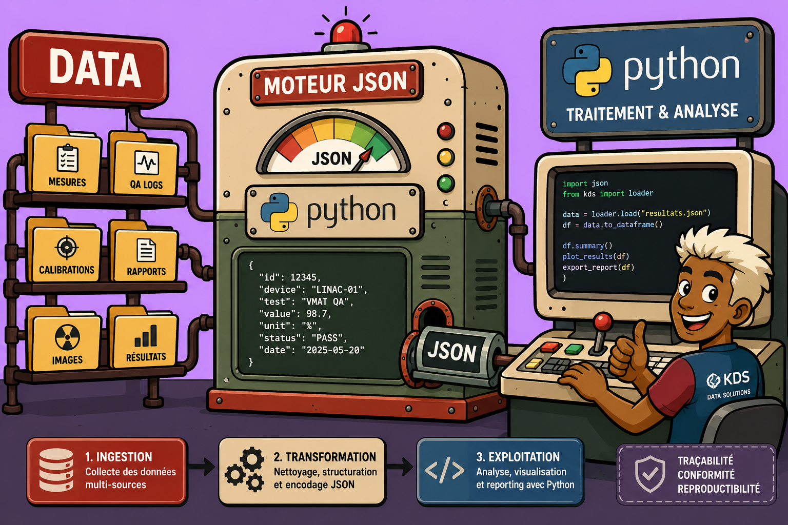

<h1 align="center">
  
</h1>

<p align="center">
  <strong>Le contrôle qualité en radiothérapie, enfin unifié.</strong><br />
  <em>Centralisez vos 135 contrôles ANSM, automatisez vos analyses et générez vos rapports d'audit en un clic.</em>
</p>

<p align="center">
  <a href="README.md">Français</a> |
  <a href="READMEs/README.en.md">English</a> |
  <a href="READMEs/README.es.md">Español</a> |
  <a href="READMEs/README.de.md">Deutsch</a> |
  <a href="READMEs/README.it.md">Italiano</a> |
  <a href="READMEs/README.pt.md">Português</a> |
  <a href="READMEs/README.ja.md">日本語</a> |
  <a href="READMEs/README.zh.md">中文</a>
</p>

<p align="center">
  <a href="https://www.kaptan-data-solutions.app/upcoming_saas"></a>
  <a href="https://kaptan-data-solutions.app/"></a>
  <a href="https://kaptandatasolutions.github.io/"></a>
  <a href="https://github.com/kaptandatasolutions"></a>
  <a href="https://ansm.sante.fr/actualites/decision-du-28-02-2023-fixant-les-modalites-du-controle-de-qualite-des-installations-de-radiotherapie-externe-et-de-radiochirurgie"></a>
  <a href="#"></a>
  <a href="Jeux%20de%20données/README.md"></a>
  <a href="#"></a>
  <a href="#"></a>
  <a href="SECURITY.md"></a>
</p>

---

<p align="center">
  <a href="https://www.kaptan-data-solutions.app/upcoming_saas">
    
  </a>
</p>

> **Un service de radiothérapie génère des dizaines de contrôles qualité par semaine, répartis sur des outils hétérogènes. Comment garantir la traçabilité, la conformité ANSM et la capitalisation des données — tout en gagnant du temps ?**

**AuditRay** est la plateforme SaaS qui unifie l'ensemble de vos contrôles qualité LINAC autour d'une architecture native ANSM 2023, d'un hub d'analyse Python ouvert et d'un écosystème communautaire de scripts et de templates.

> *Le but n'est pas un tableau de bord qui impressionne — c'est une plateforme qui fiabilise votre AQ au quotidien et libère du temps pour ce qui compte.*

---

## À propos de ce dépôt

Ce dépôt héberge les **releases publiques d'AuditRay**, la documentation officielle, les templates de rapports, les jeux de données de référence et les guides d'intégration communautaires.

**AuditRay n'est pas open-source** — ce dépôt ne contient pas le code source de la plateforme principale. En revanche, il est ouvert aux contributions de la communauté via l'API publique et le système de templates/plugins.

<p align="center">
  <strong>Un projet porté par <a href="https://github.com/kaptandatasolutions">kaptandatasolutions</a></strong><br />
  <em>Retrouvez nos articles et tutoriels sur le <a href="https://kaptandatasolutions.github.io/">blog KDS</a> — physique médicale, Python, IA et AQ en radiothérapie.</em>
</p>

---

## ✨ Fonctionnalités

> [!NOTE]
> Ce dépôt contient un **référentiel national collaboratif** structuré en 4 axes à la racine : [`jeux-reels-anonymises/`](jeux-reels-anonymises/README.md), [`donnees-synthetiques/`](donnees-synthetiques/README.md), [`cas-hors-tolerances/`](cas-hors-tolerances/README.md) et [`scripts-analyse/`](scripts-analyse/README.md). Les données brutes par type de test (Picket Fence, Winston-Lutz, VMAT…) se trouvent dans [`Jeux de données/`](Jeux%20de%20données/README.md).

<table>
  <tr>
    <td width="50%" valign="top">
      <h3>🏗️ Architecture native ANSM 2023</h3>
      <p>Les 135 contrôles UC1–UC8 et S1–S3 sont modélisés directement dans la structure de données et les workflows. Aucune reconstruction documentaire a posteriori.</p>
    </td>
    <td width="50%" valign="top">
      <h3>📥 Import multi-sources</h3>
      <p>DICOM, CSV, formats propriétaires PTW / IBA (quand non cryptés). Moteur d'import centralisé avec traçabilité complète jusqu'à la mesure source.</p>
    </td>
  </tr>
  <tr>
    <td width="50%" valign="top">
      <h3>🐍 Hub d'analyse Python — API REST</h3>
      <p>Chaque physicien déploie ses propres modules d'analyse via l'API REST publique. Les résultats alimentent directement les tableaux de bord de conformité AuditRay.</p>
    </td>
    <td width="50%" valign="top">
      <h3>📊 Benchmark inter-centres</h3>
      <p>Comparaison LINAC du même type entre établissements. Ajustez vos seuils d'action par retours d'expérience agrégés sur la plateforme.</p>
    </td>
  </tr>
  <tr>
    <td width="50%" valign="top">
      <h3>📄 Rapports d'audit en un clic</h3>
      <p>Génération automatique de rapports réglementaires traçables, prêts à présenter lors des visites de contrôle ANSM.</p>
    </td>
    <td width="50%" valign="top">
      <h3>🤝 Écosystème communautaire</h3>
      <p>Marketplace de plugins d'analyse et de templates de rapports développés par la communauté des physiciens médicaux français et internationaux.</p>
    </td>
  </tr>
</table>

---

## 📁 Structure du dépôt

```
auditray-release/
│
│  ── Référentiel national collaboratif ──────────────────────────────────
├── jeux-reels-anonymises/             # Données terrain LINAC réels, anonymisées
├── donnees-synthetiques/              # Données générées pour l'entraînement IA
├── cas-hors-tolerances/               # Dépassements cliniques pertinents et rares
├── scripts-analyse/                   # Scripts Python intégrables via API AuditRay
│
│  ── Données de référence par type de test (ANSM) ───────────────────────
├── Jeux de données/                   # Données brutes de référence
│   ├── README.md
│   ├── picket-fence/                  # UC3 — MLC
│   ├── winston-lutz/                  # UC3 — Isocentre
│   ├── vmat-qa/                       # UC4/UC5 — Contrôle patient VMAT
│   ├── mlc-transmission/              # UC3 — Transmission MLC
│   ├── starshot/                      # UC3 — Rotation gantry
│   ├── beam-output/                   # UC2 — Rendement faisceau
│   ├── field-size/                    # UC2 — Taille de champ
│   ├── gamma-index/                   # UC4/UC5 — Indice gamma patient
│   └── image-qualite/                 # UC6 — Qualité d'image
│
│  ── Documentation & gouvernance ────────────────────────────────────────
├── AuditRay_img.png                   # Logo officiel AuditRay
├── README.md                          # Ce fichier (Français)
├── READMEs/                           # Traductions
│   ├── README.en.md                   # English
│   ├── README.es.md                   # Español
│   ├── README.de.md                   # Deutsch
│   ├── README.it.md                   # Italiano
│   ├── README.pt.md                   # Português
│   ├── README.ja.md                   # 日本語
│   └── README.zh.md                   # 中文
├── CONTRIBUTING.md                    # Guide de contribution
├── CODE_OF_CONDUCT.md                 # Code de conduite
├── SECURITY.md                        # Signalement de vulnérabilités
└── poster_SFPM2026_AuditRay.html      # Poster SFPM 2026 — Lyon
```

---

## 🚀 Contribuer

### Plugins d'analyse

Soumettez votre script Python via une pull request sur `community-plugins.json` :

```json
{
  "id": "mon-analyse-picket-fence",
  "name": "Picket Fence — Mon LINAC",
  "author": "Prénom Nom / CHU de Ville",
  "description": "Analyse UC3 — positionnement MLC pour Varian TrueBeam.",
  "ansm_controls": ["UC3"],
  "linac_type": ["Varian TrueBeam"],
  "repo": "utilisateur/depot-github",
  "language": "Python",
  "requires": ["pylinac>=3.0", "pydicom"]
}
```

### Templates de rapports

Soumettez votre mise en page via `community-templates.json` :

```json
{
  "name": "Rapport UC1-UC8 mensuel — CHU",
  "screenshot": "previews/rapport-chu-blurred.png",
  "regulatory_version": "ANSM 2023",
  "controls_covered": ["UC1","UC2","UC3","UC4","UC5","UC6","UC7","UC8"],
  "author": "Prénom Nom / CHU de Ville"
}
```

> [!IMPORTANT]
> **Aucune donnée patient (PHI / DCP) ne doit figurer dans vos contributions.** Anonymisez systématiquement vos fichiers DICOM avant tout commit. Consultez [SECURITY.md](SECURITY.md) pour les règles d'anonymisation.

Consultez [CONTRIBUTING.md](CONTRIBUTING.md) pour le guide complet.

---

## 🚀 Accès anticipé — Rejoignez les physiciens pionniers

> [!IMPORTANT]
> **AuditRay est en cours de déploiement.** Les physiciens médicaux qui s'inscrivent dès maintenant bénéficient d'un **accès prioritaire**, d'une **période d'essai offerte** et d'une **influence directe sur la roadmap** — vos retours terrain façonnent la plateforme.

**Pourquoi s'inscrire maintenant ?**

- ✅ **Accès prioritaire** — soyez parmi les premiers établissements à utiliser AuditRay avant le lancement public.
- ✅ **Essai gratuit** — testez la plateforme sur vos propres données LINAC sans engagement.
- ✅ **Co-construction** — vos besoins terrain (équipements, protocoles, formats) guident les développements prioritaires.
- ✅ **Communauté fondatrice** — intégrez le réseau des physiciens pionniers et partagez scripts et retours d'expérience.
- ✅ **Conformité ANSM dès le premier jour** — architecture UC1–UC8 / S1–S3 native, sans adaptation.

<p align="center">
  <a href="https://www.kaptan-data-solutions.app/upcoming_saas">
    
  </a>
</p>

<p align="center"><em>Inscription gratuite · Sans engagement · Données sécurisées</em></p>

---

## 🔗 Liens

<table>
  <tr>
    <td align="center">
      <a href="https://kaptan-data-solutions.app/">
        <br />
        <sub>Plateforme AuditRay</sub>
      </a>
    </td>
    <td align="center">
      <a href="https://kaptandatasolutions.github.io/">
        <br />
        <sub>Articles & Tutoriels</sub>
      </a>
    </td>
    <td align="center">
      <a href="https://www.kaptan-data-solutions.app/forum">
        <br />
        <sub>Forum communautaire</sub>
      </a>
    </td>
    <td align="center">
      <a href="https://www.kaptan-data-solutions.app/contact">
        <br />
        <sub>Support & Contact</sub>
      </a>
    </td>
  </tr>
</table>

---

## 📋 Politiques

| Document | Description |
|---|---|
| [CONTRIBUTING.md](CONTRIBUTING.md) | Guide complet pour soumettre plugins, templates et corrections |
| [CODE_OF_CONDUCT.md](CODE_OF_CONDUCT.md) | Règles de la communauté AuditRay |
| [SECURITY.md](SECURITY.md) | Signalement de vulnérabilités et règles PHI/DCP |
| [Jeux de données/README.md](Jeux%20de%20données/README.md) | Données brutes de référence par type de test (UC ANSM) |
| [jeux-reels-anonymises/](jeux-reels-anonymises/README.md) | Référentiel — données terrain LINAC anonymisées |
| [donnees-synthetiques/](donnees-synthetiques/README.md) | Référentiel — données générées pour l'IA |
| [cas-hors-tolerances/](cas-hors-tolerances/README.md) | Référentiel — dépassements cliniques rares |
| [scripts-analyse/](scripts-analyse/README.md) | Référentiel — scripts Python communautaires |

---

<p align="center">
  <sub>
    AuditRay est développé et maintenu par
    <a href="https://github.com/kaptandatasolutions"><strong>kaptandatasolutions</strong></a>
    —
    <a href="https://kaptan-data-solutions.app/">kaptan-data-solutions.app</a>
    •
    <a href="https://kaptandatasolutions.github.io/">Blog KDS</a>
  </sub><br />
  <sub><em>Merci de contribuer à rendre le contrôle qualité en radiothérapie plus sûr et plus efficace.</em></sub>
</p>
